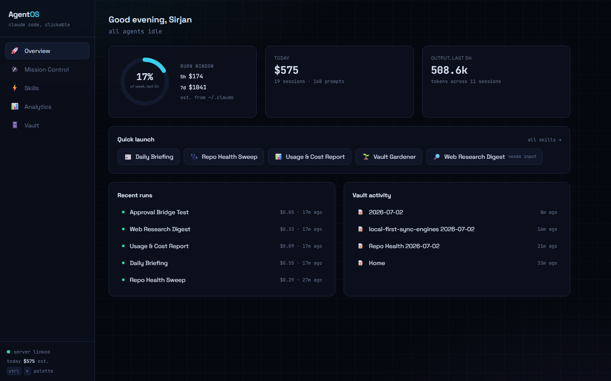
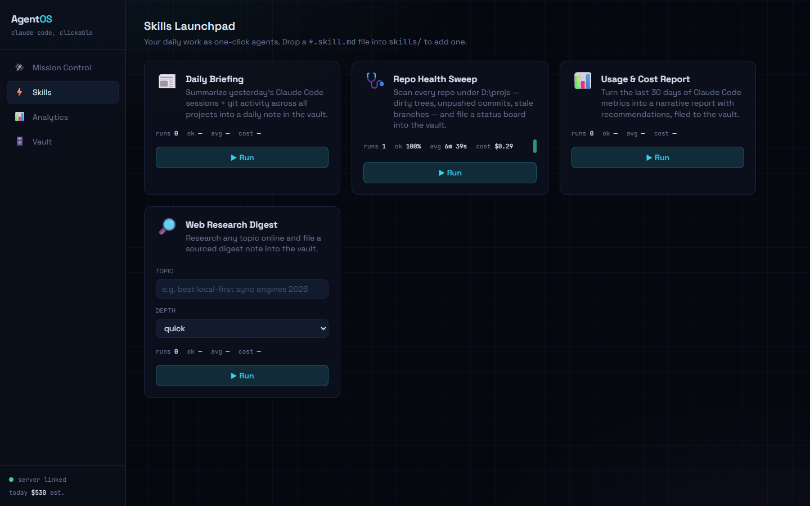
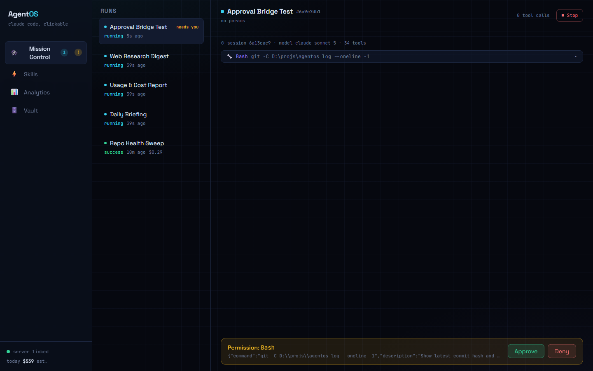
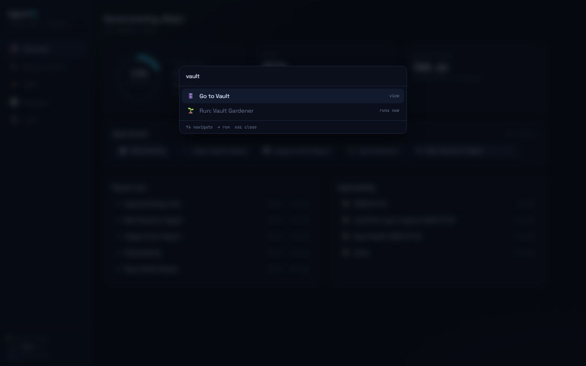

# AgentOS

A local **visual agentic OS** for Claude Code: a dark-cockpit dashboard that turns your daily
workflows into one-click skills, streams agent runs live, shows the metrics the terminal can't
(cost/token charts, per-skill stats), and files every output into an Obsidian vault.

Built on the official [`@anthropic-ai/claude-agent-sdk`](https://docs.claude.com/en/api/agent-sdk/overview) —
uses your existing Claude Code login, no API key.

> Inspired by the "Claude Code Agentic OS" idea (skills + vault memory + observability dashboard)
> popularized by [Chase AI](https://www.chaseai.io/blog/build-claude-code-agentic-os-3-steps).

## What it looks like



| Skills Launchpad | Mission Control (live run + approval) |
| --- | --- |
|  |  |

| Command palette (Ctrl+K) |
| --- |
|  |

## Quick start

```bash
npm install
npm run dev     # server on :4310 (API + WS), web on :4311
```

Open <http://localhost:4311>. Requires Node 20+, a logged-in Claude Code CLI, and Windows/macOS/Linux.

## The five views

- **Overview** — the deck: a 5-hour burn ring (what share of this week's usage happened in the
  last 5h — the same rolling window Claude Code's rate limits use), today's spend, quick-launch
  chips for every skill, recent runs and vault activity. `Ctrl+K` opens a command palette to
  jump anywhere or run any skill.
- **Skills** — every `skills/*.skill.md` manifest becomes a launchpad card with params, run
  stats (success rate, avg duration, avg cost) and a duration sparkline. One click runs it.
- **Mission Control** — live transcript of every agent run streamed over WebSocket: assistant
  text as it's generated, collapsible tool calls/results, and an **approval bar** — any tool
  outside a skill's allowlist pauses the agent until you click Approve/Deny (5-min timeout denies).
- **Analytics** — parses `~/.claude/projects/**/*.jsonl` for real usage: daily cost (estimated
  from a per-model price table), cost by project, tool usage, and a weekday×hour activity heatmap.
  AgentOS's own runs are excluded by default (feedback-loop guard).
- **Vault** — browse and preview the Obsidian vault where skills file their outputs. Point
  `vaultPath` in `agentos.config.json` at a real vault and the notes appear in Obsidian.

## Adding a skill

A skill is a manifest, not code. Drop a file into `skills/`:

```markdown
---
name: My Skill
description: What it does, shown on the card.
icon: "🔧"
params:
  - { name: topic, label: Topic, type: text, placeholder: "e.g. …" }
allowedTools: [Read, Glob, Write]
maxTurns: 30
---

The prompt template. Use {{topic}} for params; {{vault}}, {{projectsRoot}}, {{today}}
are auto-injected.
```

It appears in the Launchpad immediately — no restart. Anything the agent tries outside
`allowedTools` comes to you as a live approval in Mission Control.

## Architecture

```
agentos.config.json      all paths & ports (vault is repointable)
server/  (Express 5 + ws + tsx)
  src/agent/runner.ts    SDK query() → every message broadcast over WS; canUseTool → UI approvals
  src/metrics/           ~/.claude JSONL parser, mtime-cached; estimated pricing table
  src/skills/            manifest loader ({{param}} substitution)
  src/obsidian/          vault init + traversal-guarded tree/read API
  data/runs.jsonl        append-only run records
web/     (React + Vite + Tailwind v4 + Recharts + Motion)
skills/  *.skill.md manifests
vault/   Obsidian vault (outputs land here)
```

## Notes

- **Costs are estimates**, computed from token counts × a static price table — not billing data.
- Run transcripts live in the browser session; run records (status, cost, duration) persist in
  `data/runs.jsonl`.
- Never grant a skill `bypassPermissions` if it can write outside this repo/vault.
